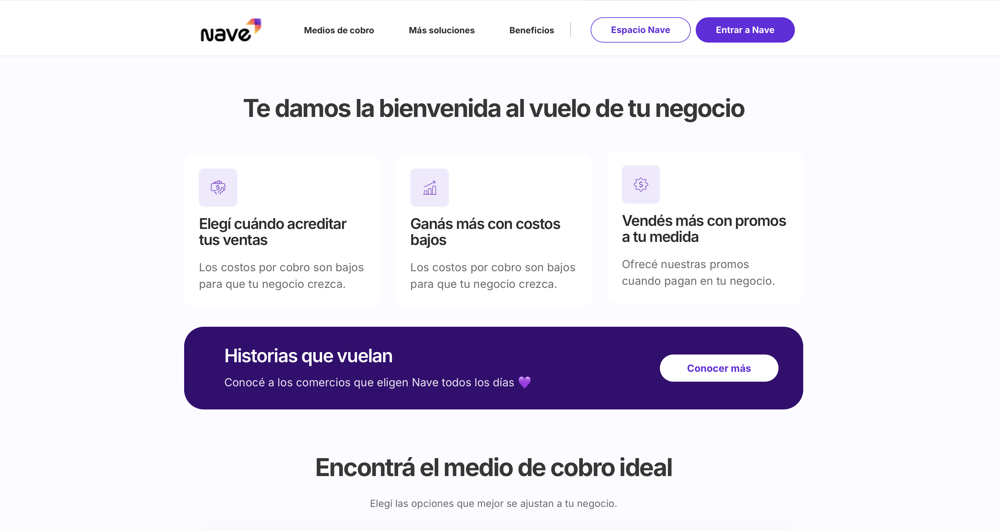
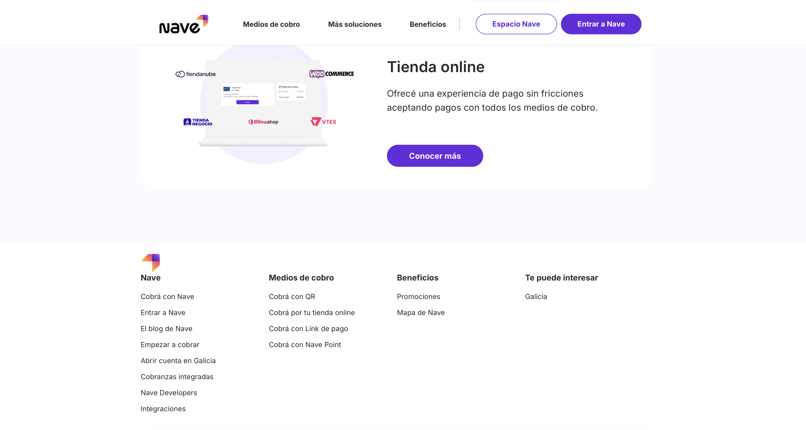

# 🚀 Nave Landing Clone

A responsive frontend clone inspired by the Nave Negocios landing page.

## 🚀 Preview

## 🧠 About

This project is a visual and structural replication of the Nave Negocios website, built to practice real-world frontend development concepts.

The main focus was on creating a clean, responsive layout while maintaining visual fidelity to the original design.

## 🛠️ Technologies

- HTML5  
- CSS3  
- Flexbox  
- Media Queries  

## 🎯 Features

- Fully responsive design (320px → 2000px)  
- Semantic HTML structure  
- Clean and modern UI  
- Layout built with Flexbox  
- Adaptive design using media queries  

## 📐 Development Approach

Before coding, the layout and structure were planned to ensure a scalable and organized implementation.

The project emphasizes:

- Proper use of semantic tags (`header`, `nav`, `section`, `footer`)  
- Consistent spacing and typography  
- Clean and readable code structure  
- Visual accuracy compared to the original Nave design  

## 📚 What I Learned

- Building responsive layouts from scratch  
- Structuring real-world landing pages  
- Improving CSS organization and readability  
- Working with breakpoints and adaptive design  
